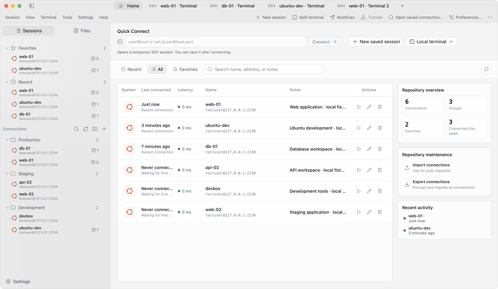
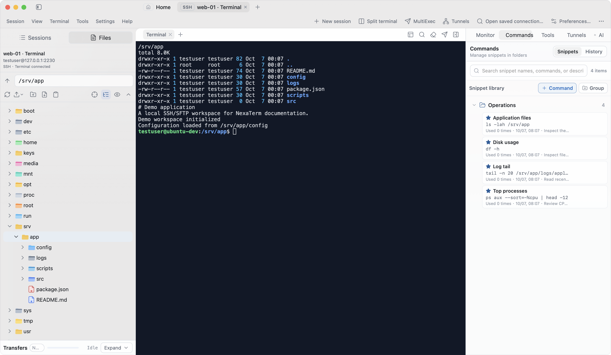
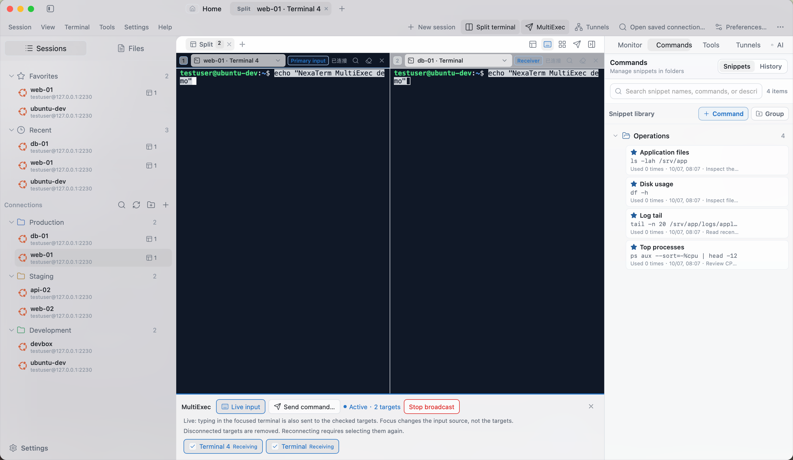
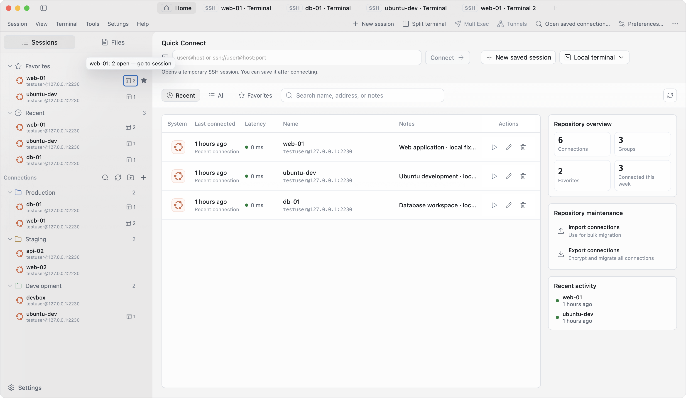
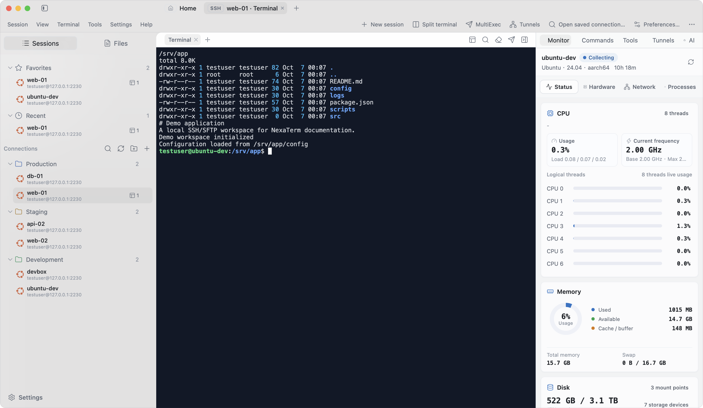
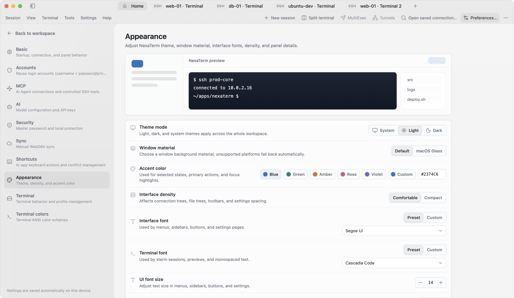

# NexaTerm

[](https://github.com/DenisZheng/NexaTerm/actions/workflows/ci.yml)
[](LICENSE)

[English](README.md) | 简体中文

**在一个桌面工作区中管理会话、终端、远程文件与运维工具。**

NexaTerm 是一个基于 Tauri、React 和 Rust 构建的轻量跨平台远程工作台。它将会话管理、终端、远程文件、分屏工作区、MultiExec、隧道和远程桌面整合在统一的桌面应用中。



## 为什么选择 NexaTerm

- **统一会话流程。** 从快速连接或保存的配置开始，用分组、收藏和最近连接整理会话。
- **独立实例。** 同一配置可以打开多个实例，以标签或分屏排列，每个终端保留自己的 Files 上下文。
- **明确控制目标。** MultiExec 只向你选择的实例发送输入。切换焦点或重连主机不会暗中改变接收目标。
- **工具与会话相连。** 文件、编辑、监控、命令、隧道、Docker 和 AI 助手围绕当前会话使用。

## 截图

以下为 macOS 原生 Tauri 窗口，使用虚构配置和本地测试服务器。

### SSH + Files

Files 位于左侧，绑定活动 SSH 实例或分屏 pane。跟随终端目录是明确的实例级开关。



### 分屏工作区 + MultiExec

选择两栏或四栏分屏，再明确勾选接收实时输入或提交命令的实例。



### 会话与分组

浏览保存配置、收藏和分组，查看已打开实例，并在批量打开分组前预览连接列表。



### 运维工具

在终端旁使用已保存命令和会话工具。



### 外观与设置

支持英文和简体中文、亮色/暗色/跟随系统，以及独立配置的终端配色。



## 核心功能

| 领域 | 能力 |
| --- | --- |
| 会话 | 统一会话管理器、快速连接、收藏、多级分组、最近连接、搜索、同一保存配置的多个实例，以及批量打开预览。 |
| 终端与桌面 | SSH、本地 Shell、Windows WSL、串口、Telnet、RDP 和 VNC；协议可用性与桌面呈现模式取决于平台及已安装的 runner。 |
| 工作区 | 实例标签、两栏/四栏分屏、可调整分屏比例，以及 live/send 两种模式的固定目标 MultiExec。断线目标失效，重连不会自动重新加入。 |
| 文件与编辑 | SSH/SFTP Files 绑定活动实例或 pane、实例级目录跟随、传输队列、上传下载、文件操作，以及带保存冲突检查的远程文本编辑器。 |
| 网络 | SSH 隧道管理器支持本地、远程与动态 SOCKS 转发；支持多跳 Jump Host 链；X11 转发需要可用的本地 X server。 |
| 运维 | 已保存命令与历史、主机监控、Docker 容器/镜像/日志、网络诊断和远端定时任务。 |
| AI 与 MCP | AI 终端助手支持选择会话上下文、提供命令建议，并配置模型服务商。MCP 提供获授权的连接/SSH 工具；Remote MCP 仅绑定 loopback，远程访问通过认证隧道。 |
| 持久化与设置 | 工作区恢复、English/zh-CN、亮色/暗色/跟随系统、加密数据导入导出、WebDAV 同步，以及应用更新基础设施。 |

工作区恢复保留布局、实例引用，以及各实例的 Files 目录和跟随开关。重连行为可配置，MultiExec 始终恢复为**关闭**。工作区快照不保存密码、私钥、运行时句柄或开启中的广播状态；不恢复未保存的远程编辑草稿。

**legacy mXterm → NexaTerm 应用数据迁移**与会话文件导入是两项独立能力。当前另有 **MobaXterm `.mxtsessions` 导入器**：预览 SSH 会话定义、报告不支持的条目，并要求补齐用户名或检查网络设置。它不导入密码或非 SSH 会话；引用的私钥路径可能需要调整。

## 协议与能力矩阵

| 能力 | 状态 |
| --- | --- |
| SSH / SFTP | 核心 |
| 本地 Shell | 核心 |
| WSL | 核心 / Windows |
| 串口 | 核心；其它平台与设备仍需实测 |
| 会话管理器 / 快速连接 | 核心 |
| 标签 / 分屏工作区 | 核心 |
| 固定目标 MultiExec | 核心 |
| 已保存命令 / 远程编辑器 | 核心 |
| 隧道 / 多跳 Jump Host | 核心 |
| 工作区恢复 | 核心 |
| 监控 / Docker 工具 | 已提供，需要合适的远端环境 |
| AI 助手 / MCP | 已提供，需要配置服务商或访问权限 |
| Telnet | Experimental（实验性） |
| RDP | Experimental（实验性） |
| VNC | Experimental（实验性） |
| X11 | Experimental（实验性） |
| 应用更新器 | 已实现，最终发布验证待完成 |

**Experimental** 表示功能已经可用，但完整的跨平台成熟度不属于当前 v1 发布门禁。RDP/VNC 模式取决于平台能力和检测到的 runner。X11 已有 Windows GUI 验收证据，macOS/Linux GUI 验证与 X server 分发决策仍待完成。串口尚未完成全部真机矩阵。Linux IME 验收继续暂缓（[PR #12](https://github.com/DenisZheng/NexaTerm/pull/12)）。

## 当前发布状态

NexaTerm 正在完成 **v1 最终发布验收**。**A01–A14 核心工作流已在记录的平台和环境范围内完成验收**，不代表三平台发布验收全部通过。

最终 **A15** 仍需验证：

- 安装包安装与启动。
- 平台签名和 macOS notarization。
- 更新器升级、恢复与回滚。
- legacy mXterm 应用数据迁移。
- 打包版本的性能与稳定性。
- 产物 hash 对账。

发布签名、notarization 和 updater 流水线已经实现，正在进行最终发布验证。证据及剩余平台边界见[路线图](ROADMAP.md)和[验收报告](.trellis/tasks/09-23-nexaterm-workflow-mainline/validation/acceptance-report-2026-10-04.md)。

## 下载

[GitHub Releases](https://github.com/DenisZheng/NexaTerm/releases) · [最新发布](https://github.com/DenisZheng/NexaTerm/releases/latest)

截至本次文档更新，仓库尚未发布公开的 GitHub Release。可用构建将通过 GitHub Releases 分发；“最新发布”链接目前跳转到发布列表，首次发布后才会指向具体版本。A15 最终签字仍待完成。

## 平台支持

| 平台 | 状态 | 发布产物 | 应用内更新目标 |
| --- | --- | --- | --- |
| Windows x64 | 支持的目标平台 | NSIS 安装包、绿色版 ZIP | NSIS 安装版 |
| macOS ARM64 / Apple Silicon | 支持的目标平台 | App / DMG、更新归档 | 已安装应用 |
| Linux x64 | 支持的目标平台 | AppImage、deb、rpm | AppImage |

以上是构建与发布目标，最终安装包验收仍由 A15 覆盖。首版不包含 macOS Intel。Windows 绿色版 ZIP 和 Linux deb/rpm 保留为手动下载格式。

## 开发

安装 Node.js、[`package.json`](package.json) 指定版本的 pnpm、Rust，以及 [Tauri 平台前置依赖](https://v2.tauri.app/start/prerequisites/)。

```sh
pnpm install
pnpm run tauri:dev
```

检查与前端构建：

```sh
pnpm run check
pnpm test
pnpm run test:scripts
pnpm run build
```

在对应宿主平台打包：

```sh
pnpm run package:win
pnpm run package:mac-arm64
pnpm run package:linux
```

`pnpm run package:all` 选择当前宿主支持的目标，不会交叉构建全部三个平台。开发服务器默认使用 5520 端口。Node.js/pnpm 用于构建；桌面运行时使用 Rust/Tauri 和原生 WebView，不依赖 Node/Express 服务。

### 参与开发

修改行为前请阅读 [AGENTS.md](AGENTS.md) 和[工作流规范](docs/WORKFLOW_SPEC.md)。开发任务与工程约定由 Trellis 维护，入口为 [`.trellis/workflow.md`](.trellis/workflow.md) 和 [`.trellis/spec/`](.trellis/spec/)。真实服务 fixture 见 [`tests/fixtures/README.md`](tests/fixtures/README.md)。

## 发布与签名概览

[发布 workflow](.github/workflows/release.yml) 构建三个目标平台。`v*` tag 会发布 GitHub Release；手动 `workflow_dispatch` 仅执行构建与产物验证，不发布版本。

`package.json`、`src-tauri/Cargo.toml` 和 `src-tauri/tauri.conf.json` 的版本号必须一致。流水线准备平台安装包、源码归档、updater `latest.json`、第三方许可声明与 `SHA256SUMS.txt`。tag 发布强制验证 Windows Authenticode 和 macOS Developer ID/notarization；updater 产物使用独立的签名信任链。所需凭据与流程见[发布签名与 notarization](docs/RELEASE_SIGNING.md)。流水线已实现不等于真实发布验证已完成。

## 项目文档

- [当前路线图与发布边界](ROADMAP.md)
- [产品需求](NEXATERM_REQUIREMENTS.md)
- [工作流规范](docs/WORKFLOW_SPEC.md)
- [A01–A15 验收报告](.trellis/tasks/09-23-nexaterm-workflow-mainline/validation/acceptance-report-2026-10-04.md)
- [发布签名与 notarization](docs/RELEASE_SIGNING.md)
- [第三方许可证](THIRD_PARTY_LICENSES.md)

## 项目来源

NexaTerm 是 [syscryer/mxterm](https://github.com/syscryer/mxterm) 的 **hard fork**，上游最初以 MIT License 发布。NexaTerm 独立开发，使用自己的 bundle ID（`com.nexaterm.app`）与发布/更新渠道，并可选择性评估上游安全修复。

mXterm 与 MobaXterm 是不同项目。NexaTerm 不是 MobaXterm 的 fork，与 MobaXterm 没有官方关联。

## 许可证

[MIT License](LICENSE)。依赖和打包组件见[第三方许可声明](THIRD_PARTY_LICENSES.md)。

## 致谢

感谢原 mXterm 贡献者，以及 Tauri、React 和 Rust 生态。
